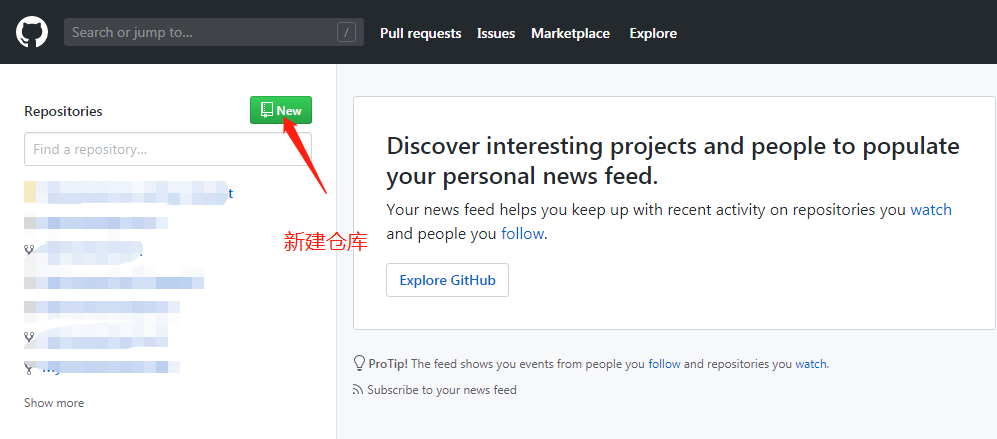

# Boring-trial
闲来无事，试试
# 创建并配置提交
### 新手第一次在GitHub上提交代码完整教程
    提交步骤：

    1、创建github repository(仓库) 

    2、安装git客户端

    3、为Github账户设置SSH key

    4、上传本地项目到github

## 一、创建github repository(仓库)
### 1.1、登录GitHub

github的官方网址：https://github.com ，如果没有账号，赶紧注册一个。

点击Sign in进入登录界面，输入账号和密码登入github。

### 1-2 创建repository(仓库--简明明了的就是新建一个空间来存放我们项目代码的地方)

创建成功后，就可以看到自己的仓库地址，如下图：

## 二、安装git客户端（git下载地址https://git-scm.com/downloads）
### 2.1、下载git

### 2.2、 安装客户端

下载好之后咋们开始安装吧，欢迎界面，下一步。

选择安装路径，千万别选带中文的路径，有时候会引起不必要的误会。

一直next，最后finish就OK

### 2.3、绑定用户

打开git-bash.exe，（在你的项目文件夹所在的地址右键点击，弹出窗口。）

 

因为Git是分布式版本控制系统，所以需要填写用户名和邮箱作为一个标识，用户和邮箱为你github注册的账号和邮箱

提示（配置的帐号名和邮箱一定要与GitHub相同，不然会提交失败）

    git config --global user.name "@@@"     (GitHub相对应的帐号名称)

    git config --global user.email "123@163.com"  （GitHbu相对应的邮箱帐号）

 

## 三、为Github账户设置SSH key
### 3.1、 生成ssh key

首先检查是否已生成密钥 cd ~/.ssh，ls如果有3个文件，则密钥已经生成，id_rsa.pub就是公钥

 

如果没有，输入: 

    ssh-keygen -t rsa -C "你的邮箱"

 

### 3.2、复制ssh key

 方法1: 输入 clip < ~/.ssh/id_rsa.pub   会自动复制ssh key，可以直接粘贴

 方法2:在c/Users/Administrator/.ssh/id_rsa)文件找到直接复制

### 3.3、连接github，打开GitHub 进入setting找到ssh key并新建

### 3.4、然后测试连接是否成功

输入: 
    
    ssh -T git@github.com 

### 3.5、进入本地要提交项目文件的的所在位置右键点击打开Git Bash Here 或者在当前命令窗口  执行  cd F:\test  进入目录。

 然后依次执行
    
    1、git init   

    2、git add .

    3、git commit -m "提交描述"

    4、git remote add origin https://github.com/MyJoanna/test.git   （这里的 https://github.com/MyJoanna/test.git 是你的仓库地址）

    5、git push -u origin master    

最后我们就可以在GitHub的仓库上看到我们提交上去的代码了

# 第一次提交的代码
    1、git init   

    2、git add .

    3、git commit -m "提交描述"

    4、git remote add origin https://github.com/MyJoanna/test.git   （这里的 https://github.com/MyJoanna/test.git 是你的仓库地址）

    5、git push -u origin master    
# 提交遇到的问题
 ## 第一个 
### 使用git clone命令从github克隆源码到电脑时出现了以下问题

    
    error: RPC failed; curl 18 transfer closed with outstanding read data remaining
    fatal: The remote end hung up unexpectedly
    fatal: early EOF
    fatal: index-pack failed
    
   究其原因是因为curl的postBuffer的默认值太小，我们需要调整它的大小，在终端重新配置大小

   在这里，笔者把postBuffer的值配置成500M，对笔者来说已经够了。可以根据你需要下载的文件大小，将postBuffer值配置成合适的大小。

    git config --global http.postBuffer 524288000
  

   这样已经配置好了，如果你不确定，可以根据以下命令查看postBuffer。

    git config --list
## 第二个
### GIT 报错：Branch ‘master’ set up to track remote branch ‘master’ from ‘origin’
    git上传仓库时报错
    在这里插入图片描述
    解决方法共两步
    1、移除
    git remote rm origin
    2、再次连接
    git remote add origin ‘地址’
## 第三个
### 在当我们输入` git remote add origin https://gitee.com/(github/码云账号)/(github/码云项目名).git `

就会报如下的错

    fatal: remote origin already exists.  

翻译过来就是：致命：远程来源已经存在

此时，我们可以先 git remote -v 查看远程库信息：

可以看到，本地库已经关联了origin的远程库，并且，该远程库指向GitHub。

解决办法如下：

1、先输入$ git remote rm origin(删除关联的origin的远程库)

2、再输入$ git remote add origin git@github.com:(github名)/(git项目名).git 就不会报错了！

3、如果输入$ git remote rm origin 还是报错的话，error: Could not remove config section 'remote.origin'. 我们需要修改gitconfig文件的内容

4、找到你的github的安装路径，我的是                 C:\Users\ASUS\AppData\Local\GitHub\PortableGit_ca477551eeb4aea0e4ae9fcd3358bd96720bb5c8\etc

5、找到一个名为gitconfig的文件，打开它把里面的[remote "origin"]那一行删掉就好了！

## 第四个
### warning: LF will be replaced by CRLF in 

原因是存在符号转义问题

windows中的换行符为 CRLF， 而在linux下的换行符为LF，所以在执行add . 时出现提示，解决办法：

    git config --global core.autocrlf false